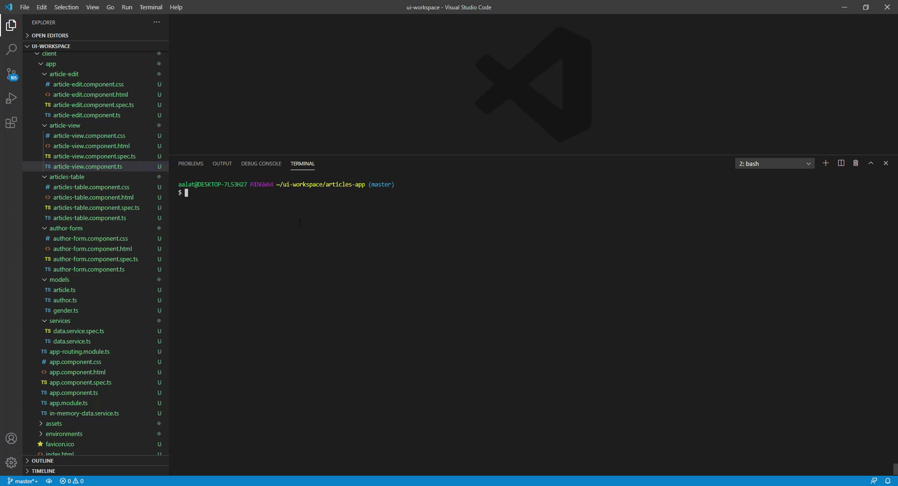
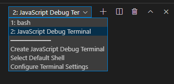

# Test Angular App with Jest, Spectator, and Cypress :eyeglasses:

The purpose of this project is to demonstrate how to configure and use [Jest](https://jestjs.io/) with [Spectator](https://ngneat.github.io/spectator/) to write unit tests, and [Cypress](https://www.cypress.io/) to write E2E tests for an Angular app. 

Please note that the unit test examples are for components and services only. Tests for directives and pipes will come soon.



### Why Jest?
* It's fast, and focuses on simplicity.
* Aims to work out of the box.
* Supports snapshots which make tests that keep track of large objects simpler.
* Improves performance by running tests in parallel in their own processes.
* Has great API, which has its entire toolkit in one place. Well documented,  and well maintained.

### Why Spectator?
* Helps remove all boilerplate required to set up test suites.
* Helps write very clean, easy, and focused tests.
* Makes query DOM elements in tests easy.
* Provides HTTP testing support.
* Provides custom matchers, e.g. toHaveClass, toBeDisabled, etc.
* Provides routing testing support.
* Provides built-in support for entry components.
* Supports auto-mocking providers.

### Why Cypress?
* Easy to install, configure, and use to write E2E tests.
* Tests can be watched and executed in real time as building the app.
* Easy to run and debug tests in CI environments.
* Supports recording CI test data, screenshots, video, etc. into a dashboard.
* Makes write E2E tests a lot easier for developers and QA engineers.
* It's fast, doesn't require Selenium.
* And more...

## Run App Locally :rocket:
Run `ng serve` for a dev server. Navigate to `http://localhost:4200/`. The app will automatically reload if you change any of the source files.

## Run Unit Tests :white_check_mark:
Run `npm test` to execute the unit tests via [Jest](https://jestjs.io/) and [Spectator](https://ngneat.github.io/spectator/)

Run tests in watch mode:
```sh
npm run test:watch
```
You can also debug your tests by adding breakpoints to the code, e.g. running JavaScript Debug Terminal in VSCode as shown below:



## Run End-to-End Tests :white_check_mark:
Run `npm run cypress:open` to start the [Cypress](https://www.cypress.io/) test server, and open the Cypress desktop app, which can be used to select the desired end-to-end tests to be executed in the browser.

Please note that `cypress:verify` and `cypress:run` commands should only be used for CI environments and pipelines

### Author :books:
[Ahmed Alatawi](https://github.com/AhmedAlatawi)
